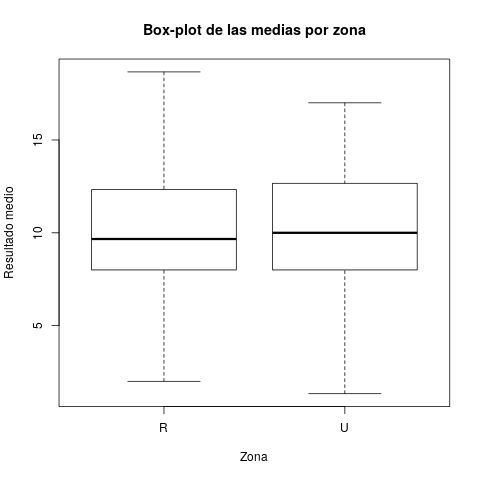
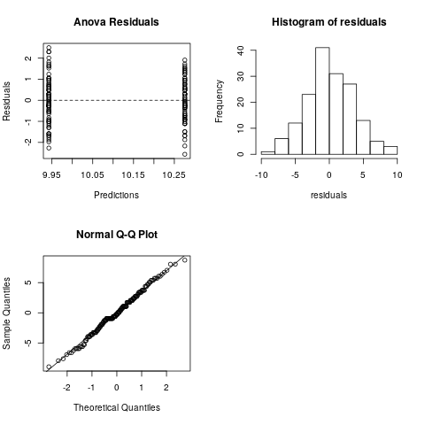

# ANOVA

Utilizando el set de datos _students-data.csv_ se quiere conocer si el dirección de un estudiande, ya sea en área rural o urbana, tiene alguna relación con la nota promedio obtenida por el mismo en las 3 evaluaciones realizadas.

Para ello se selecionaron los datos y se colocaron en una tabla de la siguiente forma:

| $Dirección$ | $Promedio$ |
| :---------: | :--------: |
|      R      |    15.6    |
|      R      |   12.93    |
|      R      |    9.0     |
|      R      |    10.7    |
|     ...     |    ...     |
|      U      |    11.2    |
|      U      |     14     |
|      U      |    8.9     |
|      U      |     19     |
|     ...     |    ...     |
|             |            |

> Los datos anteriores no son reales, solamentemente muestran la estructura utilizada.


Una vez agrupados los datos de esta forma se procede a hacer el análisis **ANOVA** para dar respuesta a la siguiente interrogante:
**¿Existend diferencias en la nota promedio de los estudiantes de diferenctes zonas?**

Un primer acercamiento a la pregunta en cuestión lo brinda el análisis de las medias de factor.



Como se puede apreciar, no hay una diferencia notable dentro de los datos procesados, por lo que es posible que no se pueda rechazar la hipótesis$(H_0)$ de que no exite diferencia. 

> NOTA: para los análisis posteriores se fijará un nivel de significación $\alpha = 0.05$

Los resultados del análisis de varianza de **ANOVA** indican exactamente lo visto anteriormente.

```
               Df Sum Sq Mean Sq F value Pr(>F)
Dirección       1    4.5    4.50   0.353  0.553
Residuals     160 2040.6   12.75
```

Como se puede observar el $p$-$value$ resulto ser mayor que la significación $\alpha$ prefijada, por tanto se puede decir que no varía la nota promedio de los estudiantes según su dirección.

Para poder concluir con certeza es necesario realizar una verificación del cumplimientos de los 3 supuestos de este modelo. Para ello se utilizarán los residuos obtenidos en el paso anterior. Los supuestos antes mencionados son:

1. Los residuos siguen una distribución normal con media cero.
2. Los residuos son independientes entre sí.
3. Los residuos de cada tratamiento tienen la misma varianza $\sigma^2$ .

Tal como en el procedimiento anterior, se puede tener una primera idea sobre el comportamiento de los supuestos si se analiza su comportamiento graficamente como se muestra a continuación. 



Este grupo de gráficos, indican que el test es válido ya que cada uno de ellos tiene el compartamiento esperado. Dado que esta información no es 100% véridica, se procesederá a realizar los test para comprobar los supuestos utilizando los residuos obtenidos del análisis de varianza.

```
Shapiro-Wilk normality test:
W = 0.99342, p-value = 0.6761

Bartlett test of homogeneity of variances:
Bartlett's K-squared = 0.75208, df = 1, p-value = 0.3858

Durbin-Watson test:
DW = 2.0016, p-value = 0.4726
alternative hypothesis: true autocorrelation is greater than 0
```

Los resultados de los test previos confirman la veracidad de el análisis de varianza realizado, dado que todos los supuestos se cumplen, hecho notable en cada uno de los test pues nuevamente todos los $p$-$value$ obtenidos son mayores que la significación $\alpha$.

# Conclusiones

El análisis realizado demuestra que el aprendizaje y los resultados de los estudiantes en cuestión no depende de la zona donde este ubicada su vivienda, por tanto para buscar datos que afecten su avance hacia mejores calificaciones será necesario realizar nuevos test.
