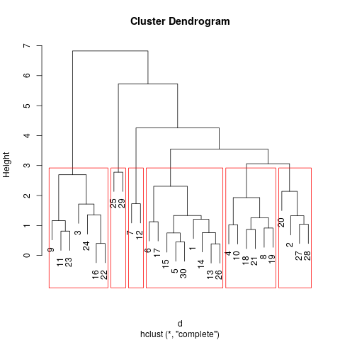

# Cluster

De los estudiantes presentes en el set de datos _students-data.csv_ se conoce que 30 de ellos están interesados mejorar su rendimiento académico. Para satisfacer su interés el profesorado quiere encontrar una distribución de aulas para agruparlos según sus necesidades para que todos los estudiantes de un aula tengan un nivel semejante.

Con el objetivo anterior se desea hacer un análisis de clusters sobre los estudiantes para agruparlos según sus resultados académicos previos. Para ellos se utilizarán la variables `G1.x, G2.x, G3.x, G1.y, G2.y, G3.y`.

Una vez estandarizados los datos se puede hacer un análisis jerárquico completo sobre ellos como se muestra a continuación:



Como se puede apreciar es posible crear una distribución de 6 aulas para agruparlos según sus resultados. Este cantidad es válida siempre que se dispongan profesores para impartir las clases. Como son 30 estudiantes y 6 profesores, la reaprtición inicial serián 5 estudiantes por aula, pero este análisis nos permite conformar de una mejor manera los grupos -que casualmente se obtuvo una media de 5 estudiantes por aula- para intentar que su aprendizaje sea más rápido dada la semejanza entre los integrantes, la cual aún desconocemos.  

Dada la incertidumbre referente al nivel de semejanza de los clusters obtenidos, utilizaremos el algoritmo **k-means** de clusters no jerárquicos para encontrar este valor desconocido.

> NOTA: El resultado completo de aplicar **k-means** se puede ver en el log del comando `make cluster`

Este algoritmo desprende resultados favorables para la investigación:

```
Within cluster sum of squares by cluster:
[1]  0.6340087  7.9790560 11.6178608  7.0645402  1.4887801  0.0000000
 (between_SS / total_SS =  83.5 %)
```

Como es apreciable se obtuvo que el factor de semejanza de los clusters es de 83.5% lo cual implica que los estudiantes han logrado demostras conocimientos parecidos en las evaluaciones por tanto se ha encontrado una buena distribución.

# Conclusiones

Las estrategias de generación de clusters permiten generar grupos con criterios de peso de manera sencilla, cosa que seria complicada manualmente dado que revisar un conjunto de 6 notas de 30 estudiantes para agruparlos no es una tarea trivial, por lo que en general no se recurre a ella en casos comunes y se conformarián los grupos a partes iguales o por afinidad entre porfesores y alumnos, lo cual elimina la posibilidad de crear grupos balanceados donde todos los estudiantes puedan llevar el mismo ritmo de aprendizaje.
