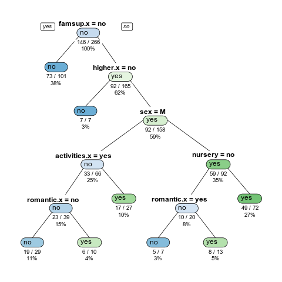

## Árbol de Clasificación

Construimos un árbol para analizar si un estudiante determinado debe optar por tener profesores particulares (además de los de la escuela) o no. Para esto utilizamos las siguiente variables cualitativas:

- `famsup` (apoyo educacional por parte de la familia)
- `higher.x` (quiere tener una educación universitaria)
- `nursery` (atiende además a la escuela de medicina)
- `activities.x` (hace actividades extracurriculares)
- `internet` (tiene internet)

Obtenemos el siguiente árbol:

El error de entrenamiento es de 0.3671.