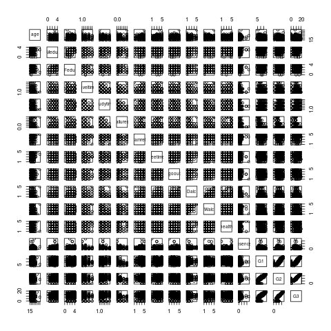
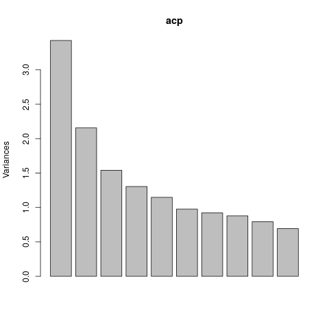
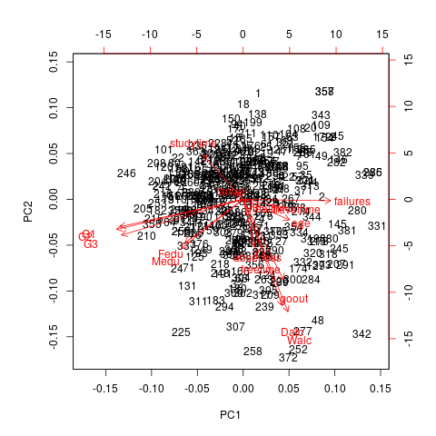

# ACP

A partir del data set _students-data.csv_ fueron extraidas variables numéricas de interés sobre los estudiante para así realizar estudios sobre ellos. Estos datos se encuentran recogidos en _sub-students-data.csv_. 

Dada la gran cantidad de datos se dificultan los estudios que se desean hacer por ello en este trabajo se hará un análisis de las componentes principales(**ACP**) para así intentar facilitar futuros procedimientos.

De manera inicial es util conocer la correlación existente entre las variables. Esta información puede ser obtenida analizandolo gráficamente y numéricamente. De la gráfica es díficil obtener información dada la cantidad de variables y el tamaño de la muestra, pero puede ser apreciada a continuación. 

De igual modo extraer datos de la matriz de correlación se hace complicado por las mismas razones anteriores. Para ver dicha matriz puede ejecutar siguiente commando desde la raiz del proyecto:

`make reduct`

A continuación se muestra la forma reducida de la matriz para una sencilla interpretación de la correlación de las variables utilizadas.

|                |  age  | Medu  | Fedu  | traveltime | studytime | failures | famrel | freetime | goout | Dalc  | Walc  | health | absences |  G1   |  G2   |  G3   |
| :------------: | :---: | :---: | :---: | :--------: | :-------: | :------: | :----: | :------: | :---: | :---: | :---: | :----: | :------: | :---: | :---: | :---: |
|    **age**     |   1   |       |       |            |           |          |        |          |       |       |       |        |          |       |       |       |
|    **Medu**    |       |   1   |       |            |           |          |        |          |       |       |       |        |          |       |       |       |
|    **Fedu**    |       |   ,   |   1   |            |           |          |        |          |       |       |       |        |          |       |       |       |
| **traveltime** |       |       |       |     1      |           |          |        |          |       |       |       |        |          |       |       |       |
| **studytime**  |       |       |       |            |     1     |          |        |          |       |       |       |        |          |       |       |       |
|  **failures**  |       |       |       |            |           |    1     |        |          |       |       |       |        |          |       |       |       |
|   **famrel**   |       |       |       |            |           |          |   1    |          |       |       |       |        |          |       |       |       |
|  **freetime**  |       |       |       |            |           |          |        |    1     |       |       |       |        |          |       |       |       |
|   **goout**    |       |       |       |            |           |          |        |          |   1   |       |       |        |          |       |       |       |
|    **Dalc**    |       |       |       |            |           |          |        |          |       |   1   |       |        |          |       |       |       |
|    **Walc**    |       |       |       |            |           |          |        |          |   .   |   ,   |   1   |        |          |       |       |       |
|   **health**   |       |       |       |            |           |          |        |          |       |       |       |   1    |          |       |       |       |
|  **absences**  |       |       |       |            |           |          |        |          |       |       |       |        |    1     |       |       |       |
|     **G1**     |       |       |       |            |           |    .     |        |          |       |       |       |        |          |   1   |       |       |
|     **G2**     |       |       |       |            |           |    .     |        |          |       |       |       |        |          |   +   |   1   |       |
|     **G3**     |       |       |       |            |           |    .     |        |          |       |       |       |        |          |   +   |   *   |   1   |
|                |       |       |       |            |           |          |        |          |       |       |       |        |          |       |       |       |
### Leyenda:

|      símbolo      |       |   .   |   ,   |   +   |   *   |   B   |   1   |
| :---------------: | :---: | :---: | :---: | :---: | :---: | :---: | :---: |
| **significación** |   0   |  0.3  |  0.6  |  0.8  |  0.9  | 0.95  |   1   |

Como se muestra, se está en presencia de datos que no son altamente correlacionados. Dado lo anterior las variables son independientes y podemos proceder a realizar el análisis **ACP** para lograr un reducción de la dimensión.

Como resultado se obtiene la importancia de las componentes

> Solo se mostraran las 7 primeras componentes, para verlas todas ver el log del comando antes mencionado

|                        |  PC1   |  PC2   |   PC3   |   PC4   |   PC5   |   PC6   |   PC7   |  ...  |
| :--------------------: | :----: | :----: | :-----: | :-----: | :-----: | :-----: | :-----: | :---: |
|   Standard deviation   | 1.8509 | 1.4684 | 1.24110 | 1.14220 | 1.07119 | 0.98828 | 0.95943 |  ...  |
| Proportion of Variance | 0.2141 | 0.1348 | 0.09627 | 0.08154 | 0.07172 | 0.06104 | 0.05753 |  ...  |
| Cumulative Proportion  | 0.2141 | 0.3489 | 0.44515 | 0.52669 | 0.59840 | 0.65945 | 0.71698 |  ...  |
|                        |        |        |         |         |         |         |         |       |

Dado los valores principales de las componentes y utilizando el criterio de **Kaiser** podemos tomar las primeras 5 componentes como las principales de los datos muestrados, lo caul implica un reducción considerable de los mismos. Esta selección. Esta selección puede ser reforzado graficamente analizando el siguiente gráfico.

Solo resta sacar resultados de los datos obtenidos; para ello es necesario conocer la matriz de valores propios.

|                |     PC1     |     PC2      |     PC3      |     PC4      |     PC5     |
| :------------: | :---------: | :----------: | :----------: | :----------: | :---------: |
|    **age**     | 0.17169428  | -0.096375675 | 0.122900815  | -0.116727605 | -0.52230504 |
|    **Medu**    | -0.23077461 | -0.230813249 | -0.543715147 | -0.088915536 | -0.01232128 |
|    **Fedu**    | -0.21676166 | -0.204272191 | -0.559993441 | -0.076942344 | 0.08553494  |
| **traveltime** | 0.16002591  | -0.038139364 | 0.319148379  | -0.084267084 | 0.08041764  |
| **studytime**  | -0.14784513 | 0.207102688  | -0.034911390 | -0.022401906 | -0.47054192 |
|  **failures**  | 0.32507813  | -0.006531465 | 0.068332064  | 0.049664978  | 0.11642778  |
|   **famrel**   | -0.03352910 | 0.029605126  | -0.064101343 | 0.586021189  | -0.24574182 |
|  **freetime**  | 0.05203081  | -0.263597314 | 0.001685637  | 0.563524636  | -0.05156450 |
|   **goout**    | 0.14935467  | -0.376609471 | -0.075532835 | 0.221715560  | -0.35687080 |
|    **Dalc**    | 0.14553046  | -0.498027111 | 0.118927504  | -0.091027971 | 0.09965108  |
|    **Walc**    | 0.16657207  | -0.527056881 | 0.138340828  | -0.124483003 | 0.06177011  |
|   **health**   | 0.06370752  | -0.034531007 | -0.056065007 | 0.301857324  | 0.50209746  |
|  **absences**  | 0.04236162  | -0.219023277 | -0.062977661 | -0.366276132 | -0.14114199 |
|     **G1**     | -0.45823864 | -0.128501492 | 0.246108714  | 0.035532688  | -0.01979275 |
|     **G2**     | -0.47075051 | -0.140318134 | 0.277523544  | -0.002009708 | 0.02699303  |
|     **G3**     | -0.45236139 | -0.167155590 | 0.283082240  | 0.044897256  | 0.03167643  |
|                |             |              |              |              |             |

>NOTA: Solo se muestran las componentes seleccionadas dado que son las que aportan datos a la investigación.

Por cada componente es necesario obtener su mayor valor propio para luego seleccionar las variables de la componente.

- **PC1:** El mayor valor propio es el asociado a los _failures_ por tanto es una componente marcada por las fallas anteriores de los estudientes, su edad y el consumo de alcohol de los mismos en sus fines de semana.

- **PC2:** El mayor valor propio es el asociado a el _studytime_ por tanto es una componente marcada únicamente por tiempo que dedican los estudiantes a su estudio individual.

- **PC3:** El mayor valor propio es el asociado a el _traveltime_ por tanto es una componente marcada por las notas recividas por el estudiante y su tiempo de viaje hacia la escuela.

- **PC4:** El mayor valor propio es el asociado a el _famrel_ por tanto es una componente marcada por las relaciones familiares del estudiante, su tiempo libre y su estado de salud.

- **PC5:** El mayor valor propio es el asociado a el _health_ por tanto es una componente marcada únicamente por el estado de salud del estudiante.

A traves de estos datos podemos apreciar como no solamente las notas son factores de importancia en el análisis de su desempeño o cualquier otra valoración que se desee hacer respecto a los estudiantes, dado que tanto su estado de salud y relaciones familiares influyen en sus indicadores principales.

Por último podemos ver el biplot resultante de convinar las componentes, para observar cuanto influencia de las variables en las componentes gráficamente. A continuación se muestra el biplot asociado a la 1era y 2da componete.

## Conclusiones:

De la reducción realizada se desprenden datos interesantes, tales como la importancia de la edad(**PC1**) de un estudiantes en sus estadísticos, lo cual implica que su nivel de madurez y responsabilidad representa un factor importante en sus resultados. También de manera perceptible tiene un efecto sobre su desempeño el nivel de estudios de su padre y madre (**PC2, PC3**) pues dicho nivel conlleva un mayor o menor nivel de exigencia de la familia hacia elestudiante. Por último vale notar como la planificación del tiempo es vital dado que tanto el tiempo de viaje (**PC4**), como el de estudio (**PC5**) tiene un marcada huella en la calidad del estudiante. 