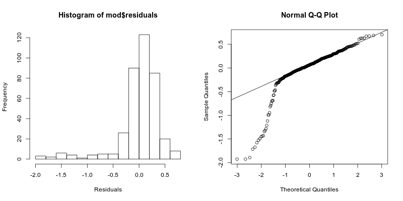
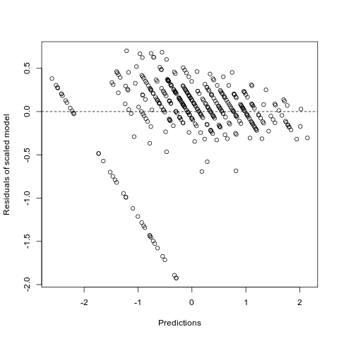

## Análisis de Regresión
---

En primer lugar hallamos la correlación entre todos los pares de variables en el data frame. Podemos apreciar que `G1.x` y `G2.x` están ambos correlacionados con `G3.x`, lo cual tiene sentido, dado que los primeros son notas de ambos semestres y el último es la nota del curso.

Luego separamos variables cualitativas de cuantitativas, para aplicarle a estas últimas una estandarización usando la función `scale`.

A continuación se creó el modelo teniendo como variable dependiente a `G3.x` y usando al resto como variables dependientes, para luego aplicar un algoritmo de `model selection` para nuestros datos, en este caso usamos la función `MASS::stepAIC`, que se encarga de eliminar a las variables independientes no necesarias.

El modelo obtenido es el siguiente:

```
lm(formula = G3.x ~ age + famrel.x + absences.x + G1.x + G2.x, 
    data = df)

Coefficients:
              Estimate Std. Error t value Pr(>|t|)    
(Intercept) -6.468e-17  2.111e-02   0.000 1.000000    
age         -5.286e-02  2.169e-02  -2.437 0.015267 *  
famrel.x     7.994e-02  2.124e-02   3.764 0.000194 ***
absences.x   7.986e-02  2.137e-02   3.738 0.000215 ***
G1.x         1.093e-01  4.172e-02   2.620 0.009152 ** 
G2.x         8.039e-01  4.204e-02  19.125  < 2e-16 ***
```

Y obtenemos estos datos del modelo:

    Multiple R-squared:  0.8321
    Adjusted R-squared:  0.8298 
    F-statistic: 372.6 on 5 and 376 DF
    p-value: < 2.2e-16

El parámetro *Adjusted R-squared* es 0.82 lo cual es bueno, es cercano a 1. El *p-valor* del estadígrafo de F es menor q 0.05 por lo que existe una variable significativamente distinta de 0 en el modelo.

De aquí en adelante hacemos análisis de residuos a este modelo.

### Análisis de residuos
---

1. Media de errores:

        Media de error residual  -3.157526e-18
        Suma de error residual   -1.20997e-15

    Por lo que se cumple que ambas son muy cercanas a 0.

2. Podemos ver el histograma de residuos y el gráfico QQ-Plot para asegurar que los errores están distribuidos normal:

    

3. Independencia de los residuos:
   
    Al realizar el test de Durbin-Watson obtenemos:

        DW = 2.0634, p-value = 0.7137

    Como $0.7137 >> 0.05$ no podemos rechazar la hipótesis nula por lo que los errores son independientes.
    
4. Homocedasticidad

    Se realiza el gráfico de predicciones contra errores residuales:

    

    Como podemos en la mayor parte de la imagen los valores son aleatorios por lo que se cumple la Homocedasticidad.
